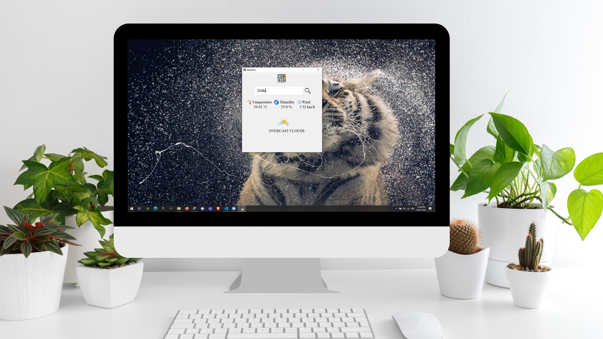
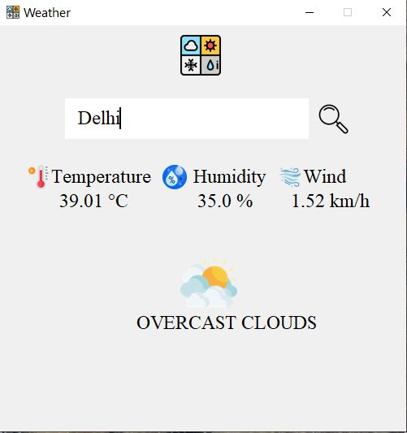

<div align="center">
  <h1 align="center"> Weather Application</h1>
</div>

## About Weather Application:
This is an Weather Application made in Python using Tkinter library.The source code is available to everyone under the standard MIT license. The Libraries used are:<br>
    1. tkinter<br>
    2. pillow<br>
    3. json<br>
    4. requests<br>
    5. bs4<br>
    6. python-decouple<br>

The API used for Fetching the weather data is by <a href="https://openweathermap.org/api/one-call-3">OpenWeather</a>.

## Want to Try it Online?
### Link: <a href="">Weather App</a>

## Screen Shots:
<div align="center">
  
</div>
<div align="center">
  
</div>

### Steps to Run on Local Machine

***

#### Note: You need to have Python installed in your Local Machine if not, first install it from <a href="https://www.python.org/downloads/windows/">here</a>.
##### Step 1) Clone AmanSinghBhogal/Weather_App.
##### Step 2) Open Weather_App Cloned Directory in Command Prompt.
##### Step 3) Go to <a href="https://openweathermap.org/api/one-call-3">OpenWeather</a>, Copy your own API Key from My API Key section, after creating an account.
##### Step 4) Paste the Copied API Key in .env.example file
##### Step 5) Rename the .env.example file to .env
##### Step 6) Run the Following commands to install necessary Libraries:
```
pip install tk pillow json bs4 requests python-decouple
```
##### Step 7) Open weather.py in Visual Studio code and Click Run.


<h1 align="center">Thank You</h1>

***